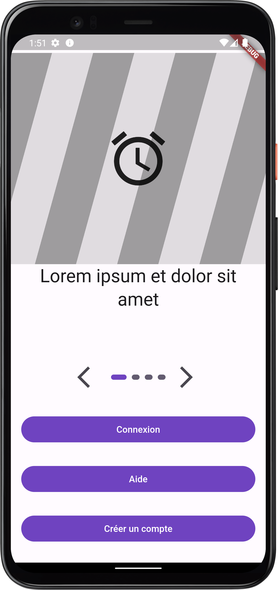

# cop_mobile_flutter_widget_responsible

Un projet pour un mob programming sur le thème des widgets responsives en Flutter.

L'écran de l'application est composé de deux parties :
- une partie supérieur qui contient un carousel d'images
- une partie inférieur qui contient des boutons

Le but est de rendre l'application responsive en fonction de la taille de l'écran.
Regle :
l'écran doit gérer les textes qui sont agrandis pour l'accessibilité.
Le caroussel a un background qui est fixe.
le texte doit rester en dessous du background du caroussel.

